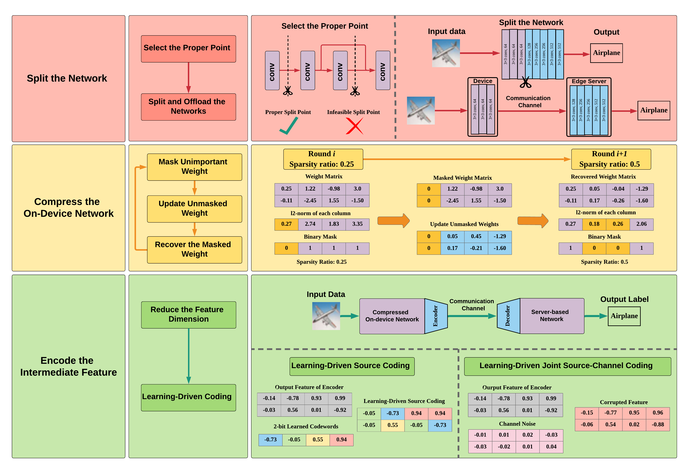

# Edge_Inference_three-step_framework
This code is for the [paper](https://arxiv.org/abs/2006.02166): "communication-computation tradeoffs in resource-constrained edge inference".


## Framework

We propose a three-step framework to reduce the end-to-end latency in the edge inference. The structure is shown as follows:



## Implementation

The three-step framework is implemented based on ResNet18. The network is split at the end of each building block.

### Dependency

```
Pytorch 1.6.0
Torchvision 0.7.0
Numpy 1.6.12
```

### Dataset

```
CIFAR-10
```
### How to Run

0. Pretrain a ResNet model from scratch or download from [here](https://github.com/shaojiawei07/some_model).
1. `model_pruning.py` uses magnitude-based pruning method to compress the on-device model with parameter `-sp1`, `-sp2`, `-sp3`, `-sp4`, and `-sp5` to denote the Sparsity ratios in different building blocks. The pruned model is named `sp1_xx_sp2_xx_sp3_xx_sp4_xx_test_acc_xxxx`.
2. `feature_compression.py` compresses the intermediate feature, which loads the pruned model by `-load`, and selects the split point by `-split`. Besides, `-hid_dim` determines the intermediate feature dimension, and `-bit n` means n-bit quantization. 


## Citation

```
@article{shao2020communication,
  title={Communication-computation trade-off in resource-constrained edge inference},
  author={Shao, Jiawei and Zhang, Jun},
  journal={IEEE Communications Magazine},
  volume={58},
  number={12},
  pages={20--26},
  year={2020},
  publisher={IEEE}
}
```


